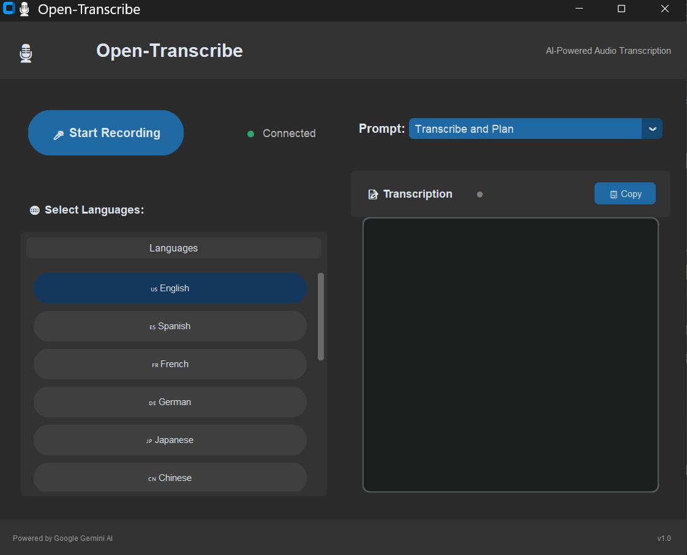

<div align="center">

# 🎙️ Open-Transcribe

**Transform Your Voice into Text with AI-Powered Precision**

## 🚀 What's New in V1.2

**We've supercharged your transcription experience!** 🎉

✨ **Sleek New Interface** - Enjoy a fresh, modern design that's as beautiful as it is functional

🌍 **Multi-Language Mastery** - Now supporting multiple languages! Transcribe in your preferred language with ease

🎯 **Dual Modes** - Choose between **Live Transcribe** for real-time transcription or **Plan Mode** for scheduled recordings

⚡ **Faster, Smoother, Better** - Optimized performance for a seamless user experience

*The future of transcription is here, and it's more powerful than ever!*

[](https://opensource.org/licenses/MIT)
[](https://www.microsoft.com/windows)
[](https://www.python.org/)
[](https://ai.google.dev/)

*The ultimate free, open-source desktop application that revolutionizes how you capture and convert spoken words! Directly record audio within the app and get instant, on-the-fly transcriptions without the hassle of uploading files.*

[📥 Download](#-quick--easy-installation) • [🚀 Features](#-why-choose-open-transcribe) • [💻 Build from Source](#-build-from-source) • [📖 Documentation](#-project-structure)

</div>

---

<p align="center">
  
</p>

---

## 🌟 Why Choose Open-Transcribe?

*   **100% Free Forever:** This application is entirely free and open-source, with no hidden costs. The Gemini API key, essential for its function, is also free to obtain, allowing for unlimited transcriptions.

*   **Seamless On-the-Fly Transcription:** Forget uploading! Simply hit record in the app, capture your audio, and get instant transcriptions. It's incredibly convenient and eliminates extra steps.
    *   **Use Cases:** Perfect for quickly transcribing:
        *   **Meetings & Lectures:** Capture every word without frantic note-taking.
        *   **Interviews:** Focus on the conversation, not the transcription process.
        *   **Personal Notes:** Dictate thoughts and ideas, then convert them to text instantly.

*   **Privacy First:** Your API key is stored securely on your device and is never transmitted externally. You retain full control over your data, and the application functions offline once set up.

*   **Cutting-Edge Technology:** Leveraging Google's Gemini AI, Open-Transcribe delivers highly accurate, multi-language transcriptions through a user-friendly interface.

---

## ⚠️ Disclaimer & Early Development Notice

Open-Transcribe is provided "as-is" and is currently in its early development stages (Version 1.0). While we are committed to providing a reliable and accurate experience and will never intentionally cause loss of your recordings, we cannot guarantee uninterrupted service or the complete absence of unforeseen issues. By using this free software, you acknowledge and agree that the developers are not responsible for any direct, indirect, incidental, special, or consequential damages, or any loss of data or profits, arising out of or in connection with the use or performance of this application. Your use of Open-Transcribe is at your sole risk.

---

## 📥 Quick & Easy Installation

### 🎯 **One-Click Install** *(Recommended for Everyone)*

Getting started takes less than 2 minutes! 

1.  **📦 Download the Installer**
    ```
    🔗 Download OpenTranscribeSetup.exe from the Windows_installer/ directory
    ```
    **[⬇️ Direct Download Link](Windows_installer/OpenTranscribeSetup.exe)**

2.  **▶️ Run & Install**
    - Double-click `OpenTranscribeSetup.exe`
    - Follow the simple on-screen setup wizard
    - Launch Open-Transcribe from your Start Menu or Desktop shortcut

3.  **🔑 Get Your FREE API Key (Gemini API)**
   - Visit [🌟 Google AI Studio](https://aistudio.google.com/apikey)
   - Sign in with Google (free account)
   - Generate your API key
   - Paste it into Open-Transcribe (only once at the first launch)

**🎉 That's it! You're ready to transcribe!**

---

## 🛠️ Build from Source

Perfect for developers, contributors, and customization enthusiasts!

### 📋 Prerequisites

```bash
✅ Python 3.x
✅ pip (Python package manager)
✅ PyInstaller (for executable builds)
✅ Inno Setup Compiler (for Windows installer)
```

### 🚀 Quick Start

```bash
# 📁 Clone the repository
git clone https://github.com/MahmoudUwk/Open-Transcribe.git
cd Open-Transcribe

# 🌐 Create virtual environment (recommended)
python -m venv .venv
.venv\Scripts\activate

# 📦 Install dependencies
pip install -r requirements.txt

# 🏃‍♂️ Run the application
python src/main.py
```

### 🔨 Building Your Own Installer

Want to create a custom build? Here's how:

1. **🎯 Build Executable**
   ```bash
   pyinstaller --onefile src/main.py --distpath src/dist --workpath src/build
   ```

2. **📦 Create Windows Installer**
   ```bash
   # Using Inno Setup Compiler
   "C:\Program Files (x86)\Inno Setup 6\ISCC.exe" src\OpenTranscribeInstaller.iss
   ```

---

## 📁 Project Structure

```
Open-Transcribe/
├── 📂 src/
│   ├── 🐍 main.py                     # Main application
│   └── 📜 OpenTranscribeInstaller.iss # Installer script
├── 📂 Windows_installer/
│   └── 💾 OpenTranscribeSetup.exe     # Ready-to-use installer
├── 📄 requirements.txt               # Python dependencies
├── 📋 README.md                      # You are here!
└── 📜 LICENSE                        # MIT License
```

---

## 🤝 Contributing

We love contributions! Here's how you can help make Open-Transcribe even better:

- 🐛 **Report bugs** - Found an issue? Let us know!
- 💡 **Suggest features** - Have an idea? We'd love to hear it!
- 🔧 **Submit pull requests** - Ready to contribute code?
- 📖 **Improve documentation** - Help others understand the project
- ⭐ **Star the repository** - Show your support!

---

## 📄 License

This project is proudly licensed under the **MIT License** - see the [LICENSE](LICENSE) file for details.

**Translation:** You can use, modify, and distribute this software freely! 🎉

---

<div align="center">

**🚀 Ready to transform your voice into text?**

[Download Open-Transcribe Now](#-quick--easy-installation) and experience the future of speech transcription!

**Made with ❤️ by the Open-Transcribe community**

*Don't forget to ⭐ star this repository if you find it useful!*

</div>