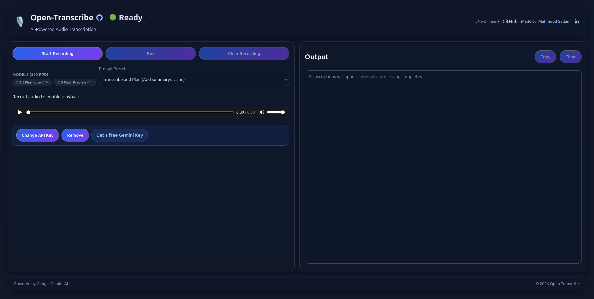

# Open-Transcribe

Browser-based audio transcription powered by Google Gemini. Record, transcribe, and get AI-generated output — no install needed.

**Live:** [open-transcribe.netlify.app](https://open-transcribe.netlify.app)

<p align="center">
  
</p>

## What's new — May 10, 2026

- **Free model pool** — two generous free-tier Gemini models with automatic FIFO rotation on rate limits (520 combined RPD)
- **Smart prompts** — cleaned-up transcriptions (no fillers/stutters), strict no-hallucination action plans, and a voice-command mode
- **Daily usage tracker** — per-model counter (X/Y RPD) resets at 3:00 AM EDT

## Quick start

1. **Get a free Gemini API key** → [aistudio.google.com/api-keys](https://aistudio.google.com/api-keys)
2. Open [open-transcribe.netlify.app](https://open-transcribe.netlify.app)
3. Paste your key, hit **Start Recording**, then **Run**

## Local dev

```bash
git clone https://github.com/MahmoudUwk/Open-Transcribe.git
cd Open-Transcribe/src
npm install
npm run dev
```

## Models

| Model | RPD | Role |
|---|---|---|
| Gemini 3.1 Flash-Lite | 500 | Primary |
| Gemini 3 Flash Preview | 20 | Fallback |

On rate-limit (429/503), the router automatically tries the next model. If all fail, it reports the error — no infinite loops.

## Prompt presets

| Preset | Use for |
|---|---|
| **Transcribe** | Clean transcription — removes fillers, stutters, false starts |
| **Transcribe & Plan** | Transcription + action items from what was said (no added suggestions) |
| **Instruction Assistant** | Voice commands — speaks code, emails, plans; model executes directly |

## Tests

```bash
npm run test          # unit tests
npm run test:bible    # integration test (requires API key in .env)
npm run test:e2e      # Playwright browser tests
npm run lint          # ESLint
```

## Security

Your API key is stored in the browser's `localStorage` only. It is never sent to any server besides Google's API. If compromised, rotate it in [AI Studio](https://aistudio.google.com/api-keys) and click **Remove** in the app.

## License

[MIT](LICENSE)
